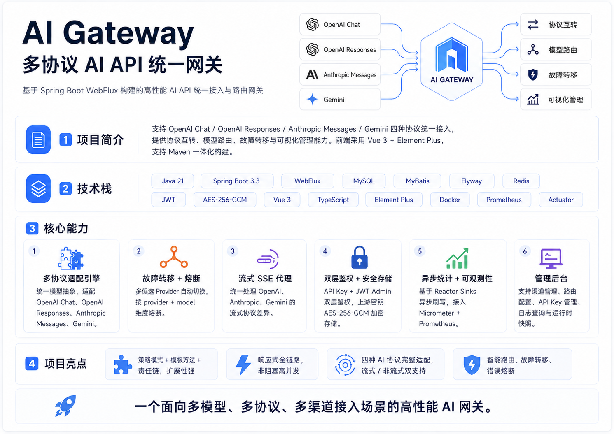
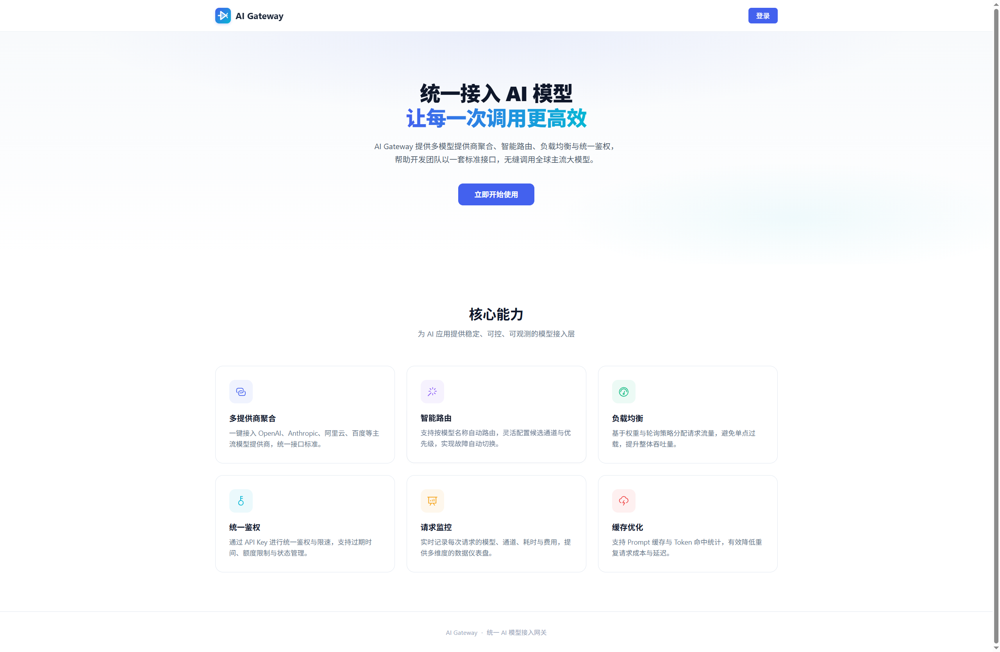
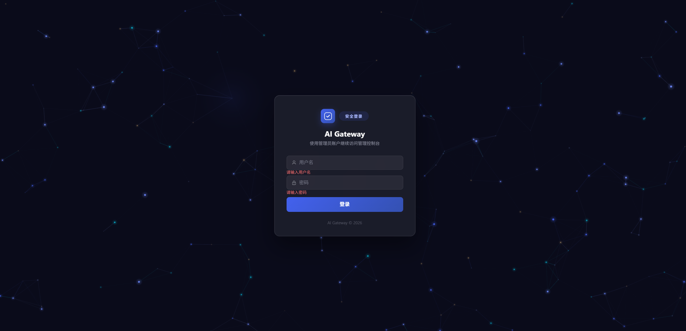
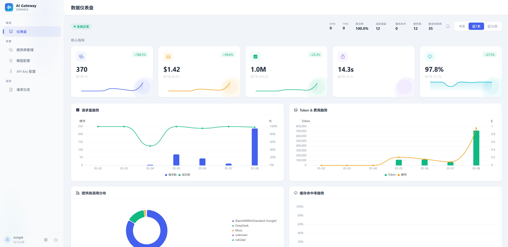
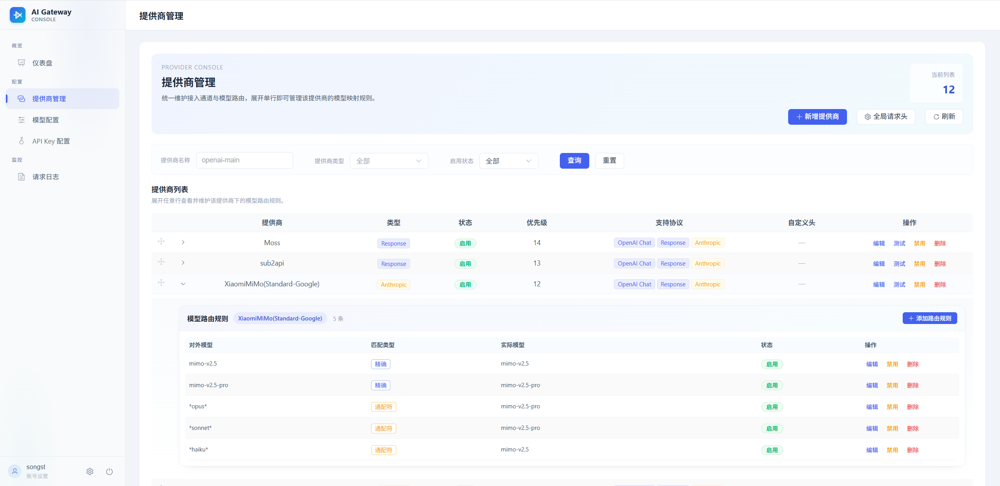
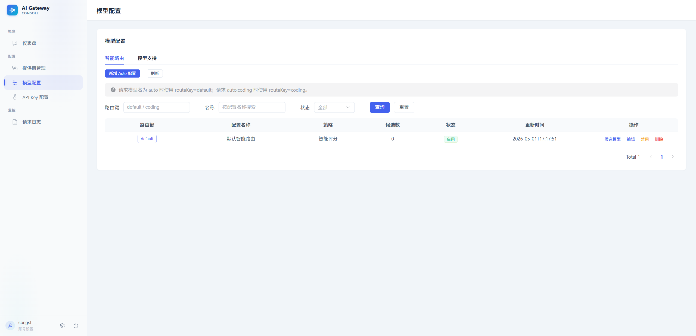
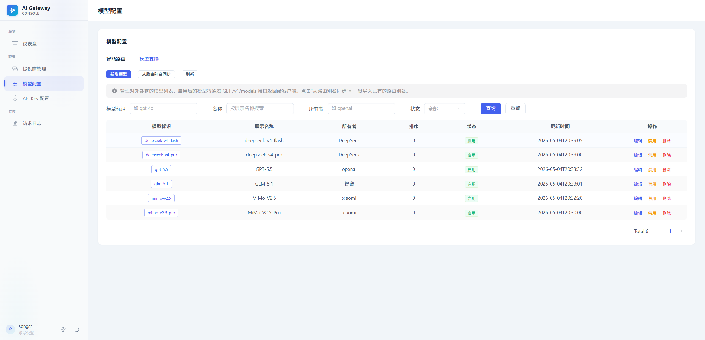
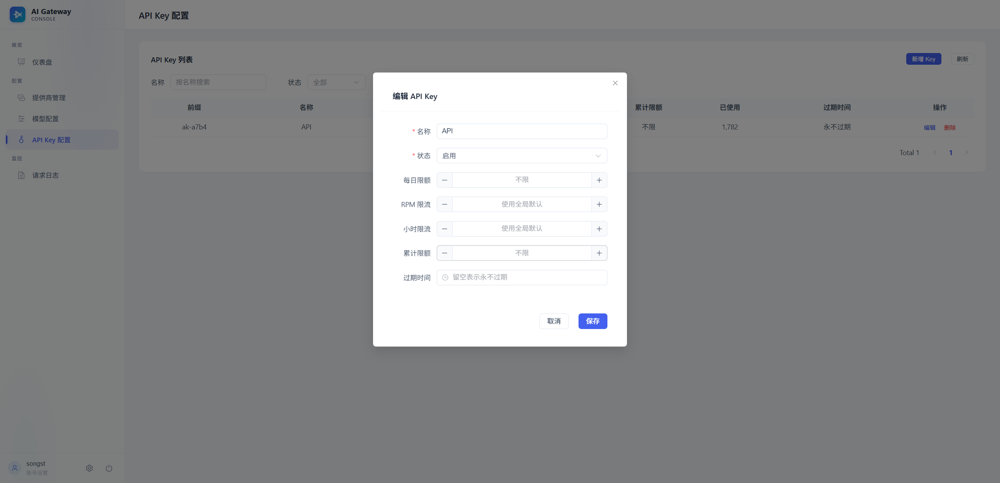
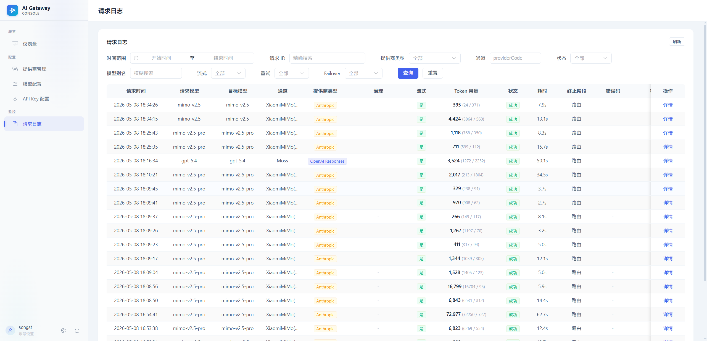
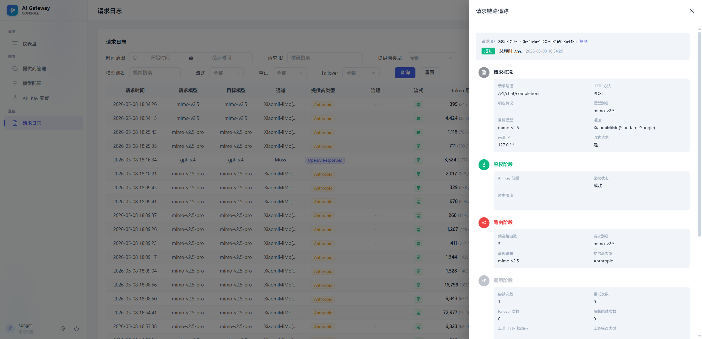

# AI Gateway

基于 Spring Boot WebFlux 的多协议 AI API 网关，支持 OpenAI / Anthropic / Gemini 等协议与多 Provider 接入，统一完成路由、鉴权、统计、治理与管理后台配置。

## 项目架构



## 项目模块

本项目采用多模块 Maven 架构，SDK 层与应用层解耦，SDK 可被任何 Java 21+ 项目独立引用：

| 模块 | Artifact ID | 说明 |
|------|-------------|------|
| **ai-gateway-sdk** | `ai-gateway-sdk` | 零 Spring 依赖的协议翻译 SDK，支持请求解析、响应编码、流式事件编码和错误构建。详见 [SDK README](ai-gateway-sdk/README.md) |
| **ai-gateway-app** | `ai-gateway-app` | Spring Boot 主应用，包含路由、鉴权、统计、Admin 管理后台等完整网关功能 |

```
AI-Gateway/
├── ai-gateway-sdk/       # 协议翻译 SDK（独立可复用）
├── ai-gateway-app/       # 网关主应用
│   ├── src/main/java/    # 后端代码
│   └── frontend-vue/     # 管理后台前端
├── pom.xml               # 父 POM（版本管理）
└── README.md
```

## 功能特性

### 多协议适配

接受多种协议请求，转换为统一内部模型处理，再按原始协议格式返回：

| 协议 | 端点 | 流式格式 |
|------|------|---------|
| OpenAI Chat | `POST /v1/chat/completions` | SSE + `[DONE]` |
| OpenAI Responses | `POST /v1/responses` | 命名 SSE 事件 |
| Anthropic Messages | `POST /v1/messages` | 命名 SSE（message_start 等） |
| Gemini | `POST /v1beta/models/{model}:generateContent` | NDJSON |

### 智能模型路由

- **持久化路由**：数据库配置 → 运行时快照 → 原子交换，配置刷新无需重启。
- **匹配方式**：路由规则支持 `EXACT` / `GLOB` / `REGEX`。
- **智能路由**：支持 Auto Route 配置与候选模型评分，默认策略为 `SMART_SCORE`。
- **模型支持表**：`supported_model` 作为对外模型列表和前端模型支持管理的数据来源。

### 双层鉴权

- **API Key 鉴权**（Layer 1）：拦截 `/v1/**` 与 `/v1beta/**`，支持 `Authorization: Bearer` 和 `X-Api-Key`，使用 `ak-` 前缀密钥，SHA-256 哈希存储，并校验状态、过期时间、每日额度、RPM、小时限额与累计额度。
- **Admin 会话鉴权**（Layer 2）：管理后台使用 HttpOnly Cookie + 数据库会话；原始 session token 仅保存在 Cookie 中，数据库保存哈希。支持登录、退出、首次初始化管理员、修改用户名和修改密码；账号敏感变更会使其他会话失效。
- **Admin CSRF 防护**：后台写操作通过 CSRF Cookie/Header 校验保护。

### 管理后台

Vue 3 + TypeScript + Element Plus 前端，Maven 构建时自动打包到后端静态资源：

- 首页：管理入口和常用功能导航。
- 登录/初始化：首次管理员初始化、登录、退出登录。
- 仪表盘：系统健康、请求量、Token、成本、RPM/TPM、模型排行、最近请求、缓存 Token。
- 接入通道管理：Provider CRUD、启用/禁用、连通性测试、拖拽排序、支持协议配置、扩展行维护路由规则。
- 模型配置：智能路由配置、候选模型评分、模型支持管理。
- API Key 管理：生成、编辑、删除、状态、过期、每日限额、RPM、小时限额、累计限额；新 Key 仅展示一次。
- 请求日志：按时间、请求 ID、Provider、通道、状态、模型别名等筛选，查看重试、Failover、限流、错误详情和终止阶段。
- 运行时状态：查看快照版本、刷新来源、Provider/规则数量、同步状态并支持手动刷新。

### 其他能力

- **流式/非流式**：完整 SSE/NDJSON 流式响应与 JSON 非流式响应。
- **异步统计**：Reactor `Sinks` 批量刷写请求日志与小时聚合统计。
- **安全存储**：Provider API Key 使用 AES-256-GCM 加密存储。
- **治理信息**：请求日志记录响应协议、请求路径、候选数、尝试数、Failover、重试、熔断跳过、限流触发、上游状态码和错误类型。
- **监控**：Actuator Health 与 Prometheus 端点。

## 技术栈

| 层 | 技术 |
|----|------|
| 后端 | Java 21, Spring Boot 3.3.5, WebFlux（响应式） |
| 数据库 | MySQL + Flyway 迁移 + MyBatis |
| 前端 | Vue 3, TypeScript, Pinia, Element Plus, Vite |
| 构建 | Maven（前端通过 frontend-maven-plugin 集成） |

## 快速开始

### 环境要求

- JDK 21+
- Maven 3.6+
- MySQL 8.0+
- Node.js 18+（仅前端开发时需要）

### 配置

编辑 `src/main/resources/application-local.yml`：

```yaml
gateway:
  auth:
    enabled: true
  security:
    api-key-secret: your-aes-256-secret-key
  admin-auth:
    session-ttl-days: 7

spring:
  datasource:
    url: jdbc:mysql://localhost:3306/aigateway
    username: root
    password: your-password
```

敏感配置不要提交到仓库，生产环境应通过环境变量或配置中心注入。

### 构建运行

```bash
# 构建（含前端）
mvn clean package

# 本地启动
mvn spring-boot:run -Plocal

# 全量测试
mvn test
```

## Docker 部署

项目提供 Docker 容器化部署方案，支持一键启停，适合生产环境快速部署。

### 前置条件

- Docker Engine 24+
- Docker Compose 2.20+

### 配置说明

复制环境变量模板并根据实际环境修改：

```bash
cp .env.example .env
```

编辑 `.env` 文件，关键配置项说明：

| 变量 | 说明 | 默认值 |
|------|------|--------|
| `DB_HOST` | MySQL 主机地址 | `localhost` |
| `DB_PORT` | MySQL 端口 | `3306` |
| `DB_NAME` | 数据库名 | `ai_gateway` |
| `DB_USER` / `DB_PASS` | 数据库账号密码 | `root` / 无 |
| `REDIS_HOST` / `REDIS_PORT` | Redis 地址和端口 | `localhost` / `6379` |
| `GATEWAY_API_KEY_SECRET` | API Key AES-256 加密密钥（64位 hex） | `0123456789...` |
| `APP_PORT` | 应用映射端口 | `8080` |

> **注意**：生产环境务必修改 `GATEWAY_API_KEY_SECRET` 为随机生成的 64 位 hex 字符串，可通过 `openssl rand -hex 32` 生成。

### 方式一：连接外部 MySQL/Redis（推荐生产）

如果已有 MySQL 和 Redis 实例，编辑 `.env` 填入正确的主机地址、端口和密码后：

```bash
docker compose up -d
```

访问 `http://localhost:8080` 进入管理后台，首次访问需初始化管理员账号。

### 方式二：全栈本地部署（含 MySQL + Redis，适合开发测试）

配合 `docker-compose.infra.yml` 同时启动 MySQL 和 Redis 容器：

```bash
# 编辑 .env，将 DB_HOST 改为 mysql，REDIS_HOST 改为 redis
# DB_HOST=mysql
# REDIS_HOST=redis

docker compose -f docker-compose.yml -f docker-compose.infra.yml up -d
```

仅启动基础设施（不启动应用）：

```bash
docker compose -f docker-compose.infra.yml up -d
```

### 手动构建镜像

```bash
# 多阶段构建（自动编译前端 + 后端）
docker build -t ai-gateway:latest .

# 使用自定义 .env 启动
docker compose up -d
```

### 查看日志

```bash
# 应用日志
docker compose logs -f app

# 数据库初始化日志
docker compose logs -f mysql

# 查看应用健康状态
curl http://localhost:8080/actuator/health
```

### 停止与清理

```bash
# 停止服务
docker compose down

# 停止并删除数据卷（将清除 MySQL 和 Redis 数据）
docker compose -f docker-compose.infra.yml down -v
```

## 功能截图

### 管理后台

| 页面 | 截图 |
|------|------|
| **首页** — 管理入口和常用功能导航 |  |
| **登录页** — 管理员登录与首次初始化 |  |
| **仪表盘** — 系统健康、请求量、Token、成本、模型排行等 |  |
| **Provider 管理** — 接入通道 CRUD、启用/禁用、拖拽排序 |  |
| **模型配置** — 智能路由配置、候选模型评分 | <br> |
| **API Key 管理** — 生成、编辑、删除、额度与限流配置 |  |
| **请求日志** — 按时间、Provider、通道、模型筛选，查看重试、Failover、限流等详情 | <br> |

### API 使用

**OpenAI Chat 兼容接口：**

```bash
curl -X POST http://localhost:8080/v1/chat/completions \
  -H "Content-Type: application/json" \
  -H "Authorization: Bearer ak-your-api-key" \
  -d '{
    "model": "gpt-4o",
    "messages": [{"role": "user", "content": "Hello!"}],
    "stream": true
  }'
```

**Anthropic Messages 接口：**

```bash
curl -X POST http://localhost:8080/v1/messages \
  -H "Content-Type: application/json" \
  -H "x-api-key: ak-your-api-key" \
  -H "anthropic-version: 2023-06-01" \
  -d '{
    "model": "claude-sonnet-4-20250514",
    "messages": [{"role": "user", "content": "Hello!"}],
    "max_tokens": 1024,
    "stream": true
  }'
```

## 项目结构

```text
ai-gateway-sdk/                           # 协议翻译 SDK
└── src/main/java/com/code/aigateway/sdk/
    ├── AiGatewaySdk.java                 # 门面类（一行式 API）
    ├── error/                            # ErrorCode / ProtocolException
    ├── model/                            # Unified* 协议无关模型 / ProtocolType
    ├── protocol/                         # ProtocolAdapter 接口与四个协议实现
    └── registry/                         # ProtocolRegistry（不可变、线程安全）

ai-gateway-app/                           # 网关主应用
└── src/main/java/com/code/aigateway/
    ├── admin/                            # 管理后台（认证 / Controller / Service / Mapper）
    ├── common/                           # 通用工具（R 响应包装 / 异常定义）
    ├── config/                           # Spring 配置类
    ├── core/
    │   ├── auth/                         # API Key 鉴权 WebFilter
    │   ├── capability/                   # 模型能力检查
    │   ├── controller/                   # 协议 Controller（薄层）
    │   ├── error/                        # 网关异常（ErrorCode / GlobalExceptionHandler）
    │   ├── model/                        # 统一模型（App 版，含 Spring 扩展字段）
    │   ├── protocol/                     # 协议适配器（Spring-aware，委托 SDK）
    │   ├── router/                       # 模型路由（Persistent / ConfigBased / Auto Route）
    │   ├── runtime/                      # 运行时快照（RoutingSnapshotHolder）
    │   ├── stats/                        # 请求统计采集
    │   └── service/                      # ChatGatewayService（核心编排）
    ├── provider/                         # Provider 客户端
    │   ├── AbstractProviderClient
    │   ├── openai/                       # OpenAI Chat + Responses
    │   ├── anthropic/                    # Anthropic Messages
    │   └── gemini/                       # Gemini GenerateContent
    └── security/                         # AES 加解密等安全组件

ai-gateway-app/frontend-vue/              # 管理后台前端
└── src/
    ├── api/                              # 后端 API 调用
    ├── components/                       # 复用组件与表单对话框
    ├── layout/                           # 侧边栏 + 顶栏布局
    ├── router/                           # 路由与登录守卫
    ├── stores/                           # Pinia 状态管理
    ├── utils/                            # 鉴权状态等工具
    └── views/                            # 首页/登录/仪表盘/通道/模型/Key/日志/运行时
```

## 数据库迁移

| 版本 | 说明 |
|------|------|
| V1 | Provider 与模型路由基础表：`provider_config`, `model_redirect_config` |
| V2 | 请求日志与小时聚合统计：`request_log`, `request_stat_hourly` |
| V3-V4 | API Key 管理与限流字段：`api_key_config`, `rpm_limit`, `hourly_limit` |
| V5-V8 | 路由配置精简、Provider 支持协议、路由匹配类型 |
| V9-V11 | 缓存 Token、取消数、请求链路追踪与治理字段 |
| V12 | Admin 认证表：`admin_user`, `admin_session` |
| V13-V16 | 智能路由配置与候选评分：`auto_route_config`, `auto_route_candidate` |
| V17-V18 | 模型支持表与唯一约束：`supported_model` |

## 监控端点

- 健康检查：`GET /actuator/health`
- Prometheus：`GET /actuator/prometheus`

## License

MIT
